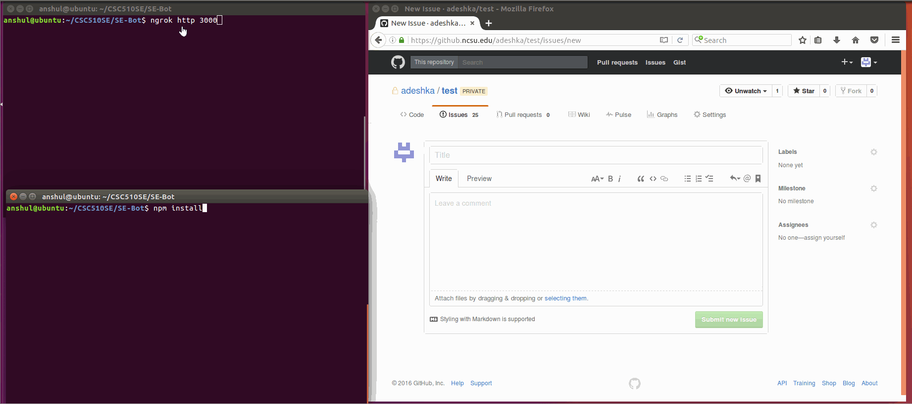
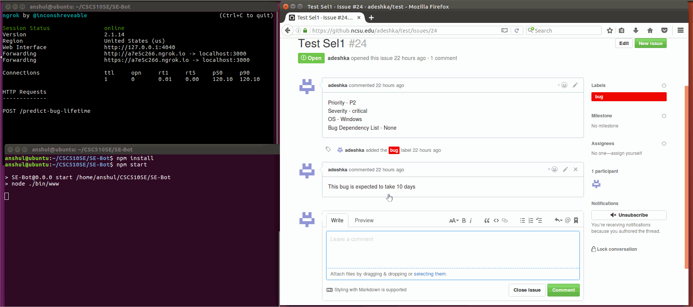
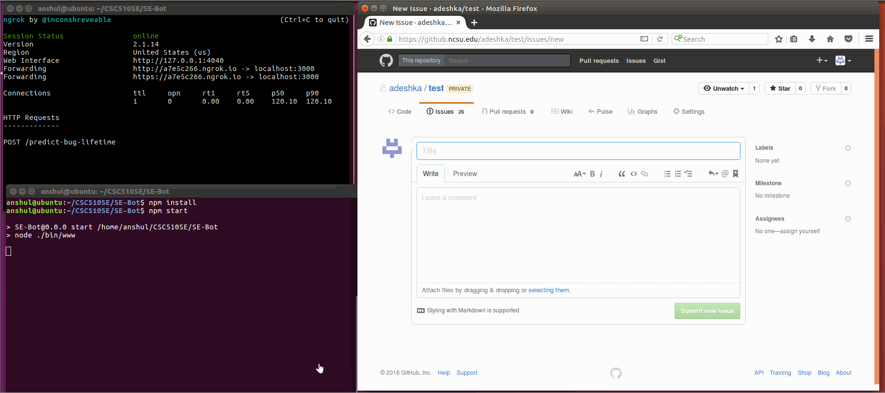
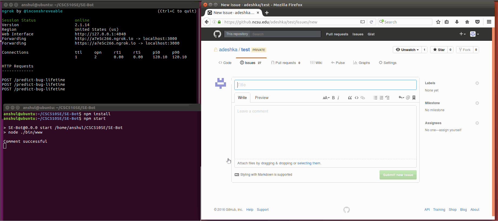

# MILESTONE: BOT


### Use Cases
```
Use Case 1: (Non-bug Issues creation)
1 Preconditions
   An issue is created/updated which is not a bug
2 Main Flow
   Bot ignores the issue
3 Subflows
  [S1] Observe the label of issue (- is not Bug)
  
Use Case 2: (Bug Issue comment)
1 Preconditions
   An issue, which is a bug, is updated/ commented upon
2 Main Flow
   Bot ignores the issue
3 Subflows
  [S1] Observe the label of issue (- is Bug)
  [S2] Observe the status of issue is (- is not Created)
4 Alternative Flows
  [E1] A new bug is mentioned in the comments; bot ignores it as new issue needs to be created for new bug
  [E2] The bug parameters have been changed; bot posts a follow-up comment

Use Case 3: (Bug issue creation with all data)
1 Preconditions
   An issue, which is a bug, is created
2 Main Flow
   Bot comments an estimated lifetime for the bug
3 Subflows
  [S1] Check action:'opened', label:'bug', assignee: > 0
  [S2] Parse the body for bug attributes - Priority, Severity, Operating System, Bug Dependency List
  [S3] Use Prediction model to get estimated lifetime of the bug
4 Alternative Flows
  [E1] Bot cannot estimate the lifetime of the bug

Use Case 4: (Bug issue creation with partial data)
1 Preconditions
   An issue, which is a bug, is created
2 Main Flow
   Partial information provided in the Bug Description
   Bot comments an estimated lifetime for the bug
3 Subflows
  [S1] Check action:'opened', label:'bug', assignee: > 0
  [S2] Parse the body for bug attributes - Priority, Severity, Operating System, Bug Dependency List; Use Default values for missing attributes
  [S3] Use Prediction model to get estimated lifetime of the bug
4 Alternative Flows
  [E1] Bot cannot estimate the lifetime of the bug
```

### Mocking Service Component
A mock model is created as the mocking service component (`predictor()` function) in the [bot.js](bot.js) file. The prediction model presented in this milestone is only demonstrative of the way in which it receives information, processes it and returns the prediction, and is not an actual implementation of the predictor.

In order to mock this behavior, we have a template bug example which is created as an issue in [this](https://github.com/avshirod/projects/tree/master/Fall_2016_-_CSC510_-_Software_Engineering_-_GitHub_Bot_for_Bug_Lifetime_Prediction) repository. We have employed a webhook which *POSTs* the JSON to our app running reachable as *localhost* .

A generic prediction is made using the mock model and posted as a comment on the originating issue.


### Bot Implementation

####Event listener
The *node* app begins by setting up webhook on the GitHub account that is mentioned in the configuration file(config.json). This webhook *POSTs* a JSON to the url provided by the app, which is then received by our app. The implementation of this needed an additional service, namely `ngrok`. This service essentially tunnels the requests coming to a globally visible url (provied by ngrok) to our app (present as *localhost*). The reason for needing this is that GitHub does not recognize the *locahost* IP address of our app, as it is not visible to it.

#### Event Parser
Our bot actively listens for event notifications being sent by the GitHub webhook.  Only those events which are tagged as a `bug`  and has a flag `opened` are considered for further processing as all other event notifications are irrelevant to the purpose of the bot. The attributes pertinent to any issue created are are fetched from this JSON, and sent to the prediction model to get the lifetime estimate.

#### Lifetime predictor
The bot after predicting the lifetime using a predictor model, comments on the issue in question, with its estimated life time. This achieves the communication between the users who open and/or handle the `issues` and the bot.

The bot can be set up to listen to event notifications coming from any number of repositories as long as it is provided with the necessary authentication information for each of those GitHub accounts. The instructions to do the same are described in the [README](README.md) file.

The above three components together achieves the <b>Bot Platform </b> setup and the <b>Bot integration</b>.

### Selenium Testing
The code for the JUnit Tests is in the Selenium directory which can be imported as a Maven project in Eclipse. Since the number of cases are limited for the scope of the bot we have 4 test for the 4 cases the bot needs to consider.
The Tests are in the file: [SEBotSeleniumTest.java](Selenium/src/test/java/UnitTests.java)


### Task Tracking
Refer: [WORKSHEET.md](WORKSHEET.md)


### ScreenCast
Case 1:




Case2:




Case 3:




Case 4:



