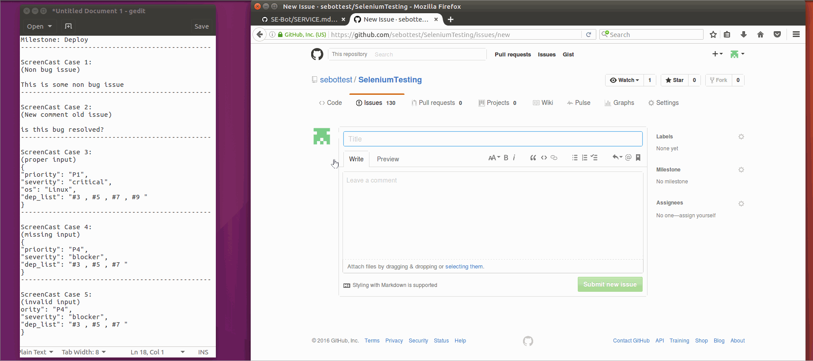
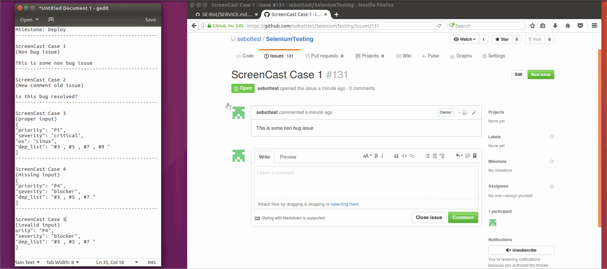
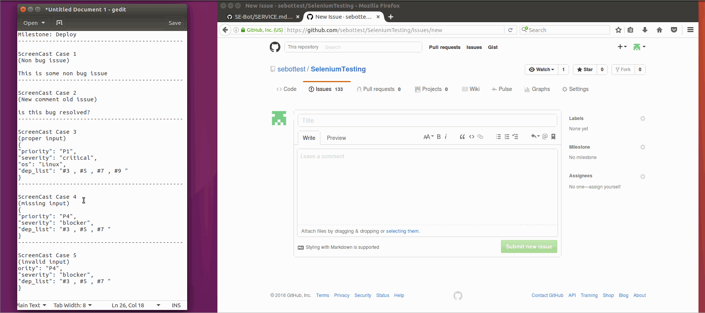

# MILESTONE: [DEPLOY](https://github.com/CSC-510/Course/blob/master/Project/DEPLOY.md)

Follow setup instructions as mentioned in [README](https://github.com/CSC-510/Course/blob/master/Project/README.md). Make sure that GitHub credentials are set. Run playbook to set up the bot.

In the instructions below, *'repository'* refers to the GitHub repository that the bot is tracking (details given in config.JSON). GitHub UI means the browser version of GitHub.


### Acceptance Testing Instructions

The currently running bot is preset to work with the GitHub user:
- username: *sebottest*
- password: *SE-Bot9367*
- repository: *SeleniumTesting*

This account can be used for Acceptance Testing.

(Alternatively, you can setup the bot with a different account, and make it track a different repository. This requires GitHub API Access tokens for those accounts to be set-up in the config.json file. For instructions, follow [README](https://github.com/CSC-510/Course/blob/master/Project/README.md).)

Visit *[Issues](https://github.com/sebottest/SeleniumTesting/issues)* page in *['SeleniumTesting'](https://github.com/sebottest/SeleniumTesting)* repository to perform acceptance tests for [use cases](BOT.md#use-cases).

**Use Case 1: (Non-bug Issues creation)**

1. Create a new issue on the repository.
2. Do **NOT** label the issue as a *‘bug’* (can label as anything else other than ‘bug’ or can use no labels).
    Description can be anything.

*Expected Output:* You will observe no output - no comment by bot on the issue.


**Use Case 3: (Bug issue creation with all data)**

1. Create a new issue on the repository.
2. *Label* the issue as a ‘bug’.
Set *assignee* as self (or add more people or none).
Any *title* is acceptable.
3. Example Description - 
```
{
    "priority": "P1",
    "severity": "critical",
    "os": "Linux",
    "dep_list": "#3 , #5 , #7 , #9 "
}
```

*Expected Output:* A comment from the bot, of the format - ```‘This bug is expected to take 120 days’.```


**Use Case 2: (Bug Issue comment)**

1. Comment on an existing issue, that is labelled as a *bug*, like the one we just created above, (or not labelled as a bug).
2. Comment content can be anything.

*Expected Output:* No comment from the bot.


**Use Case 4: (Bug issue creation with partial data)**

1. Create a new issue on the repository.
2. *Label* the issue as a ‘bug’.
Set *assignee* as self (or add more people or none).
Any *title* is acceptable.
3. Set description with at least one of the inputs in JSON missing. e.g. -
```
{
    "priority": "P4",
    "severity": "blocker",
    "dep_list": "#3 , #5 , #7 "
}
```
In the above description, the value for *'os'*  (operating system) is not mentioned.

*Expected Output:* A comment from the bot, of the format - ```‘This bug is expected to take 113 days (Assuming the following default values: Operating system - Other, Assignees count - 1)’.```


**Use Case 4: (Improper data format)** (Additional test case)

1. Create a new issue on the repository.
2. *Label* the issue as a ‘bug’.
Set *assignee* as self (or add more people or none).
Any *title* is acceptable.
3. Set description with at least one of the inputs in JSON missing. e.g. -
```
    ority": "P4",
    "severity": "blocker",
    "dep_list": "#3 , #5 , #7 "
}
```

*Expected Output:* A comment from the bot, of the format -  ```‘Invalid JSON format. Sample format:
{ "priority": "P4", "severity": "critical", "os": "Linux", "dep_list": "#3 , #5 , #7 " }’ ```.


#### Screencasts for Functioning Use Cases

Case 1:


Case 2:


Case 3:


Case 4:


Case 4 (Additional Example):

