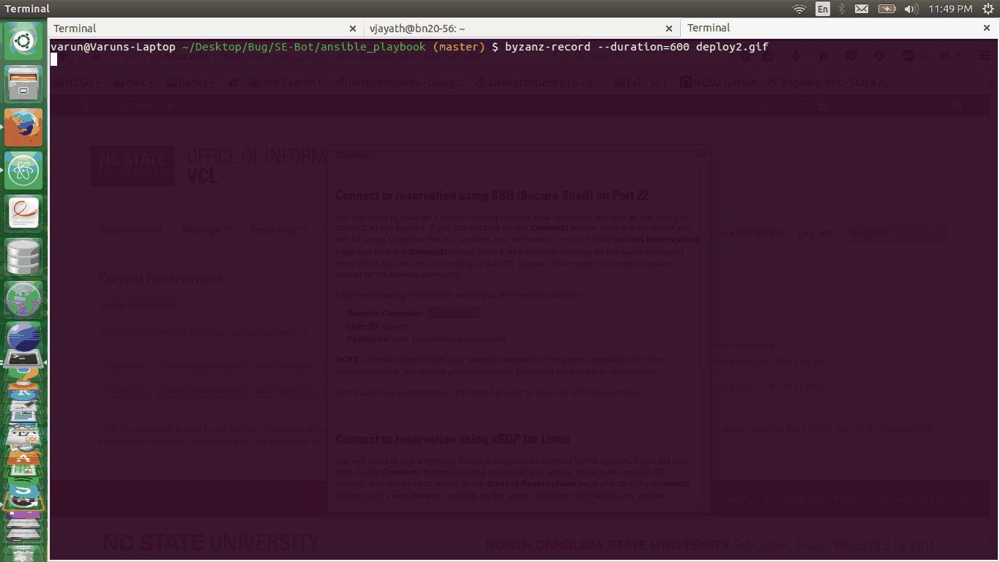

# Predicting Lifetime for Bugs on GitHub Issues
## CSC 510 - Software Engineering - Fall 2016

## Team Members:
* Aditya Shirode (avshirod)
* Anshul Prakash Deshkar (adeshka)
* Parin Sanghavi (prsangha)
* Varun Jayathirtha (vjayath)

## Milestones:
* DESIGN.md added for Design milestone
* FIXDESIGN.md for Design fixes
* BOT.md added for Bot milestone

### Setup/installation

NOTE: Instructions provided for Ubuntu 14.04 target system.

* Create a `config.json` file (Recommended to be in same directory as Ansible). This JSON is structured as follows:

```javascript
{
    "github_api_url": "https://api.github.com",
    "github_access_token": "token 24cce29f648c5ee76714c3e39adbd2de3afcf032",
    "repositories": [
        {
            "name": "SeleniumTesting",
            "owner":"sebottest",
            "access_token": "token 24cce29f648c5ee76714c3e39adbd2de3afcf032"
        }
    ],
    "ngrok_api_url": "http://127.0.0.1:4040/api/tunnels/",
    "app_port": "3000",
    "app_route": "/predict-bug-lifetime"
}
```
The fields marked in angular brackets are customizable values, needed to be filled by the user, which could be pertinent to their github account or repository. The `github_api_url` field can be kept the same if the bot is being used on a github.com account. If not , `"https://github.ncsu.edu/api/v3"` should be used instead. The `github_access_token` is of the bot's github account which is used to comment. The `app_port` can be customized to any port number. Although care must be taken to maintain uniformity in the port number used here and in the later steps. All the remaining fields (`ngrok_api_url` etc) need to be used as is. More than one repositories can be provided as an array of JSONs. Each of these repositories will be assigned a web hook that is triggered by an 'issues' event.

    - `<repository-name>` : Repository to which the event Web Hook belongs.
    - `<user-id>`: Id of the owner of the said repository.
    - `<github-access-token>`: Access token needed make API calls, specific to the said owner.
    - `<port number>`: Port address of the local app. (For example: "3000").

* Fetch the Ansible playbook [file](https://github.ncsu.edu/adeshka/SE-Bot/blob/master/ansible_playbook/setup.yml)
* Setup a Private Public key pair for Ansible to have access to the remote machine. To do this, run the following on your local machine.
    * `ssh-keygen -t rsa`    
    * Press enter (default). The ssh key pair will be stored in `~/.ssh` directory.
    * Place the contents of `id_rsa.pub` in `~/.ssh/authorized_keys` file on the target machine.
    * Note the path of the private key.
* Setup inventory file for the playbook. This files contains all the necessary information to establish the connection with the target machine. Below is the format
    <machine_name> ansible_ssh_host=<ip_addr> ansible_ssh_user=<remote_username> ansible_ssh_private_key_file=<path_to_private_key>

* Set the environment variables on the host. This includes GitHub credentials of a collaborator to access the code of the bot from the private repository.
   - export GITHUB_USERNAME=<username>
   - export GITHUB_PASSWORD=<password>
   - export NGROK_PORT=<port_number>
   - export CONFIG_PATH=</path/to/config.json>
   - export APP_PATH=</path/to/the/app/SE-Bot>

    A sample set of values for the above:
   - Username = vjayath
   - Password =  ******
   - Port_number = 3000
   - /path/to/config.json =  ./config.json (as config.json was in same directory as ansible playbook)
   - /path/to/the/app/SE-bot = /home/vjayath/SE-Bot

* Run the playbook using this `ansible-playbook -i <inventory file> <playbook-file.yml>`. Below is the screen cast of a playbook in execution.

* Check the functionality of the bot as described in the [use cases](https://github.ncsu.edu/adeshka/SE-Bot/blob/master/DEPLOY.md).
