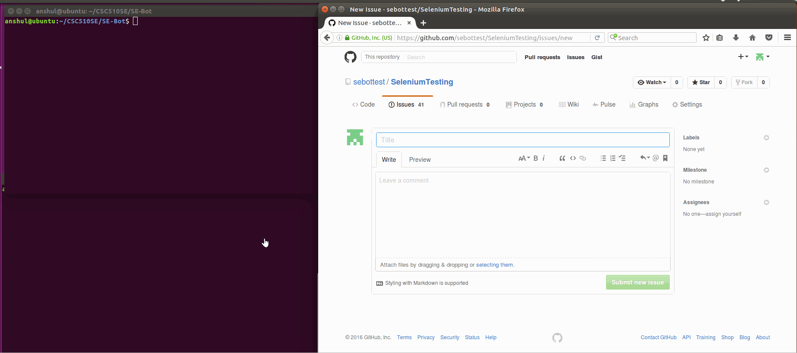
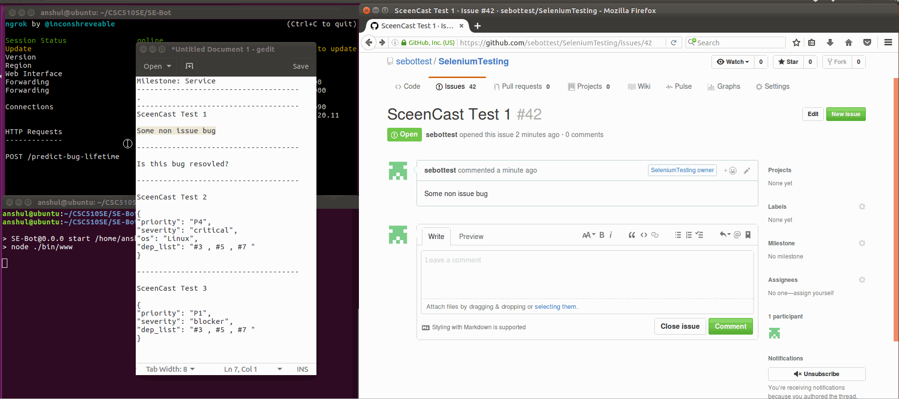
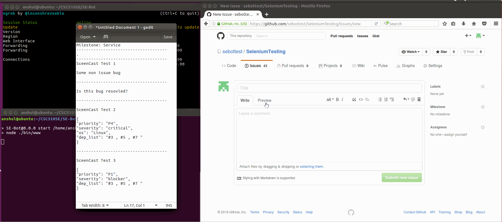
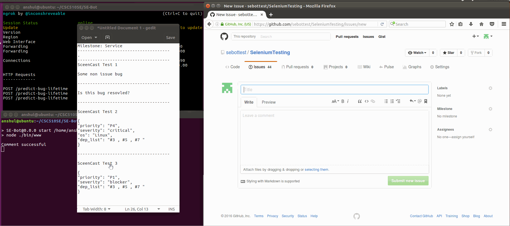

# MILESTONE: [SERVICE](https://github.com/CSC-510/Course/blob/master/Project/SERVICE.md)

[Code](lib/bot.js)

[Predictor Model](lib/predict.R)

### Bot and Predictor Model

The basis for this bot is a [research](http://dl.acm.org/citation.cfm?id=1269043) published in 2007 on 'Predicting Bug Life Times', by Dr. Panjer.
Quoting the author :
> In non-trivial software development, projects planning and allocation of resources is an important and difficult task. Estimation of work time to fix a bug is commonly used to support this process. 

Taking reference from the paper, we are using machine learning and data mining tools to predict the lifetime of a bug. We trained our model on data obtained from [REST API](https://wiki.mozilla.org/Bugzilla:REST_API) for [Mozilla's Open Source Bugzilla](https://bugzilla.mozilla.org/) bug repository.

[Sample Bug](https://bugzilla.mozilla.org/show_bug.cgi?id=35), &nbsp;
[JSON Obtained using REST API](https://bugzilla.mozilla.org/rest/bug/35), &nbsp;
[Customized JSON Used for this Project](https://bugzilla.mozilla.org/rest/bug/35?include_fields=priority,severity,depends_on,op_sys,creation_time,cf_last_resolved,cc,status)

We obtained a basic dataset of about [13000 bug reports](data/data.csv) from the above dataset to train our model. We implemented [Decision Tree](https://en.wikipedia.org/wiki/Decision_tree_learning) and [Naive Bayes](https://en.wikipedia.org/wiki/Naive_Bayes_classifier) as suggested in paper. After running some tests on [test data](data/test.csv), we decided that Decision Tree gave more accurate results. 

The model is generated in 'R' using this [code](lib/model.R).
The bot send input to this [file](lib/predict.R), which uses the previously generated model from training data to predict the lifetime fo the bug.
The bot uses the values of `Priority, Severity, depends_on (Bug dependency), op_sys (Operating System), creation_time, cf_last_resolved (When Bug State Changed to Resolved), cc (Number of watchers), status` for training. (Refer [this](https://bugzilla.mozilla.org/page.cgi?id=fields.html) for detailed information about the fields).

To predict the lifetime of a newly created bug on GitHub Issues, the bot inspects the body of the issue description and passes the value to [Predictor](lib/predict.R).
As explained in [Bot Milestone](BOT.md), the bot generates a comment with predicted lifetime for the corresponding bug.

The following example explains how the bot works in the background.
* A new issue is created on a GitHub repository that the bot is watching. The issue description syntax is as follows - 
    * `{ "priority": __ , "severity": __ , "os": __ , "dep_list": __ " }`
* Let us consider the issue with description - 
    * `{
"priority": "P4",
"severity": "critical",
"os": "Linux",
"dep_list": "#3 , #5 , #7 "
}`
* This translates into input of `4 2 2 3 1` for *Predict.R* file. In the input, the values correspond to priority, severity, operating system type, # of dependencies on other bugs, and assignee count, resp. We have mapped the values of various input types to integers and have discretized the prediction time into equally sized bins.
* Using the model, our bot predicts a lifetime of **113 days** for this bug. It posts the following comment on the corresponding issue - 

    > *This bug is expected to take 113 days.*.

### Use Case Implementation

[Referring back to use cases](BOT.md#use-cases)

The outcome of Use cases 1 and 2 (Non-bug Issues Creation and Bug Issue Comment) is not affected by the model, as they do not concern our predictor model.

In Use Case 3, we specify all the required parameters with proper values in the issue description which is created as a bug. The bot sees this, generates a corresponding input for our model, and receives a predicted lifetime value, as explained above. It then posts a comment on that issue mentioning number of days predicted.
The comment is of the format - `This bug is expected to take ___ days.`

In Use Case 4, we specify the required parameters partially. In this case, the bot generates the input for the predictor model assuming certain default values (based on our training data). 
The default values are as follows - `Priority: P5, Severity: normal, OS: Other, Dependency: None`. We assume the assignee count to be `0`. 
The comment posted on this type of issue is of the format - `This bug is expected to take ___ days. Assuming the following default values - ______. `

### Task Tracking
Refer: [WORKSHEET.md](WORKSHEET.md)

### Screencast
Use Case 1:

Use Case 2:

Use Case 3:

Use Case 4:

